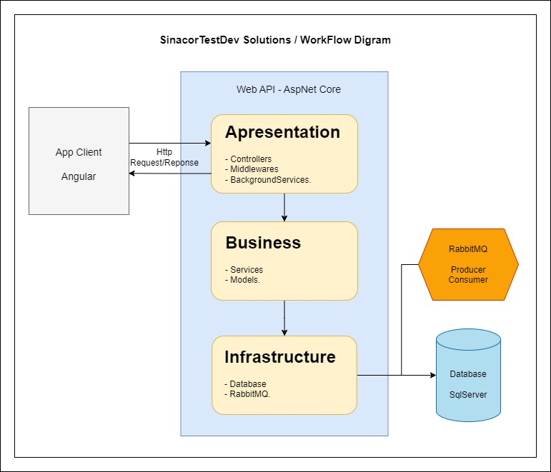

# SinacorTestDev
Esta é uma aplicação para a candidatura de vaga como Desenvolvedor Fullstack na empresa B3 / Sinacor.

## Orientações do teste:
- Construir uma app para cadastro e consulta de tarefas (descrição/data/status).
- Arquitetura, página em Angular + API +  Worker com comunicação via RabbitMQ em .Net6  C#.
* _Itens relevantes:_
- Ter logs para suporte da aplicação.
- Aplicação de design patterns.
- Utilização de framework de persistência.
- Banco de dados livre.

Portanto seguindo essas orientações, nessa aplicação é possível visualizar a listagem de tarefas, cadastrar e editar as tarefas, além de um campo para buscar as tarefas pelo nome;

Sistema utilizando uma API com ASPNET Core WebAPI e páginas em Angular;

## Tecnologias utilizadas
A seguir algumas tecnologias utilizadas para implementar essas regras solicitadas:

#### Frameworks
- Dotnet Core 6
- Angular CLI: 17
- Node: 20.10.0
- Package Manager: npm 10.2.3

#### Bibliotecas:
- Bootstrap - para estilização de alguns componentes, como formularios e botões;
- Serilog - para registrar logs de erros na aplicação;
- RabbitMQ - para auxiliar no workflow de troca de status das tarefas;
- Migration - para facilitar na criação de database e tabelas.
- EntityFramework - para fazer a persistência das informações no banco;
- SQLServer Express - para facilitar a criação do server do BD;

#### Design Patterns
- SOLID
- Repository Pattern
- Dependcy Injection
- ExceptionMiddleware

#### IDEs
- Visual Studio 2022 Community - p/ webapi
- Visual Studio Code - p/ app client
- Azure Data Studio - p/ banco de dados

## Flow diagram
- Utilizado uma arquitetura em camadas para a API:



## Como Executar:

Siga os seguintes passos para rodar a aplicação:

1. Clone este repositório:

```bash
  git clone https://github.com/alexandre1sakata/SinacorTestDev.git
  cd SinacorTestDev

```

#### Back-end - webapi

1. Restaurar o pacotes
```bash
  cd SinacorTestDev.WebAPI
  dotnet restore
```

##### *Libs externas para configurar no ambiente*

2. Subir imagem do SqlServer ou instalar no windows
- Docker image (dockerfile_sqlserver):
 ```bash
  docker build -t sqlserver -f dockerfile_sqlserver .
  docker run -e 'ACCEPT_EULA=Y' -e 'MSSQL_SA_PASSWORD=admin123!' -p   1433:1433 -d sqlserver
 ```

- Windows installer:
    - [SQL Server Express - download link](https://www.microsoft.com/pt-br/sql-server/sql-server-downloads)

3. Subir imagem do RabbitMQ ou instalar por windows installer

- Docker image (dockerfile_rabbitmq):
```bash
  docker build -t rabbitmq -f dockerfile_rabbitmq .
  docker run -d -p 5672:5672 -p 15672:15672 rabbitmq
```

- Windows installer:
    - [RabbitMQ - download link](https://www.rabbitmq.com/download.html)

4. Rodar o Migrations para criar as tabelas do banco
```bash
  abrir Package Manager Console (Visual_Studio)
  Default_Project => SinacorTestDev.API.Database
  rodar_comando update-database
```

5. Se achar necessário, build da api
```bash
  dotnet build
```

6. Inicie a aplicação da api
```bash
  dotnet run
```

#### Front-end - app client

1. Instale as dependências
```bash
  cd ..
  cd SinacorTestDev.Client
  npm install
```

2. Inicie a aplicação do client
```bash
  npm start
```
